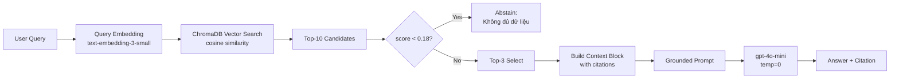
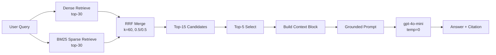

# Architecture — RAG Pipeline (Day 08 Lab)

> Template: Điền vào các mục này khi hoàn thành từng sprint.
> Deliverable của Documentation Owner.

## 1. Tổng quan kiến trúc

```
[Raw Docs]
    ↓
[index.py: Preprocess → Chunk → Embed → Store]
    ↓
[ChromaDB Vector Store]
    ↓
[rag_answer.py: Query → Retrieve → Rerank → Generate]
    ↓
[Grounded Answer + Citation]
```

**Mô tả ngắn gọn:**
> Nhóm xây dựng RAG pipeline cho internal knowledge base của doanh nghiệp, giúp nhân viên tra cứu policy (hoàn tiền, SLA, access control, HR) mà không cần tìm thủ công trong nhiều file. Hệ thống nhận câu hỏi tiếng Việt, tìm đoạn văn bản liên quan từ 5 tài liệu nội bộ, rồi dùng LLM sinh câu trả lời ngắn gọn có trích dẫn nguồn. Use case chính: IT helpdesk, CS refund queries, HR policy lookup.

---

## 2. Indexing Pipeline (Sprint 1)

### Tài liệu được index
| File | Nguồn | Department | Số chunk (ước tính) |
|------|-------|-----------|---------|
| `policy_refund_v4.txt` | policy/refund-v4.pdf | CS | ~4 |
| `sla_p1_2026.txt` | support/sla-p1-2026.pdf | IT | ~5 |
| `access_control_sop.txt` | it/access-control-sop.md | IT Security | ~4 |
| `it_helpdesk_faq.txt` | support/helpdesk-faq.md | IT | ~3 |
| `hr_leave_policy.txt` | hr/leave-policy-2026.pdf | HR | ~3 |

> Dùng `inspect_metadata_coverage()` trong `index.py` để xem số chunk thực tế.

### Quyết định chunking
| Tham số | Giá trị | Lý do |
|---------|---------|-------|
| Chunk size | 400 tokens (~1600 ký tự) | Đủ context cho 1 điều khoản, không quá dài để gây noise |
| Overlap | 80 tokens (~320 ký tự) | Tránh cắt giữa câu liên tiếp giữa 2 chunk |
| Chunking strategy | Hybrid: heading-based trước, paragraph-based fallback | Heading giữ nguyên cấu trúc doc; paragraph chia đều phần còn lại |
| Metadata fields | source, section, effective_date, department, access | Phục vụ filter, freshness, citation |

> **Chi tiết**: `index.py` split theo pattern `=== ... ===` trước (section heading), sau đó trong mỗi section dùng `_split_by_size()` chia theo paragraph với overlap từ chunk trước.

### Embedding model
- **Model**: `text-embedding-3-small` (OpenAI) nếu có `OPENAI_API_KEY`; fallback: `paraphrase-multilingual-MiniLM-L12-v2` (sentence-transformers, local)
- **Vector store**: ChromaDB `PersistentClient` — lưu tại `chroma_db/`, collection `"rag_lab"`
- **Similarity metric**: Cosine (`hnsw:space = cosine`)

---

## 3. Retrieval Pipeline (Sprint 2 + 3)

### Baseline (Sprint 2)
| Tham số | Giá trị |
|---------|---------|
| Strategy | Dense (embedding similarity) |
| Top-k search | 10 |
| Top-k select | 3 |
| Rerank | Không |

### Variant (Sprint 3) — Hybrid, no rerank
| Tham số | Giá trị | Thay đổi so với baseline |
|---------|---------|------------------------|
| Strategy | Hybrid (dense + BM25 via RRF) | dense → hybrid |
| Top-k search | 15 | 10 → 15 |
| Top-k select | 5 | 3 → 5 |
| Rerank | Không (cross-encoder đã thử ở Variant 1, gây giảm điểm) | — |
| Query transform | Không | — |
| Dense weight | 0.5 | mới (semantic vs keyword cân bằng) |
| Sparse weight | 0.5 | mới (BM25) |
| RRF k | 60 | mới (hằng số chuẩn) |

**Lý do chọn variant này:**
> Corpus trộn lẫn ngôn ngữ tự nhiên (policy clauses) và exact keyword (tên tài liệu cũ "Approval Matrix", mã priority "P1", tên trường "subscription"). Dense search bỏ lỡ exact-term queries. Hybrid (dense + BM25 RRF) giải quyết được alias query (q07, q10) mà không cần reindex. Không dùng rerank vì cross-encoder English-only chấm tiếng Việt kém (-0.60 faithfulness ở Variant 1).

---

## 4. Generation (Sprint 2)

### Grounded Prompt Template
```
Answer only from the retrieved context below.
If the context is insufficient, say you do not know.
Cite the source field when possible.
Keep your answer short, clear, and factual.

Question: {query}

Context:
[1] {source} | {section} | score={score}
{chunk_text}

[2] ...

Answer:
```

### LLM Configuration
| Tham số | Giá trị |
|---------|---------|
| Model | `gpt-4o-mini` (OpenAI, default) hoặc `gemini-2.0-flash` (nếu `LLM_PROVIDER=gemini`) |
| Temperature | 0 (deterministic — ổn định cho eval) |
| Max tokens | 512 |
| Provider | Đọc từ `.env`: `LLM_PROVIDER=openai` hoặc `gemini` hoặc `groq` |

---

## 5. Failure Mode Checklist

> Dùng khi debug — kiểm tra lần lượt: index → retrieval → generation

| Failure Mode | Triệu chứng | Cách kiểm tra |
|-------------|-------------|---------------|
| Index lỗi | Retrieve về docs cũ / sai version | `inspect_metadata_coverage()` trong index.py |
| Chunking tệ | Chunk cắt giữa điều khoản | `list_chunks()` và đọc text preview |
| Retrieval lỗi | Không tìm được expected source | `score_context_recall()` trong eval.py |
| Generation lỗi | Answer không grounded / bịa | `score_faithfulness()` trong eval.py |
| Token overload | Context quá dài → lost in the middle | Kiểm tra độ dài context_block |

---

## 6. Diagram

### Baseline (Dense)


### Variant (Hybrid + No Rerank)

